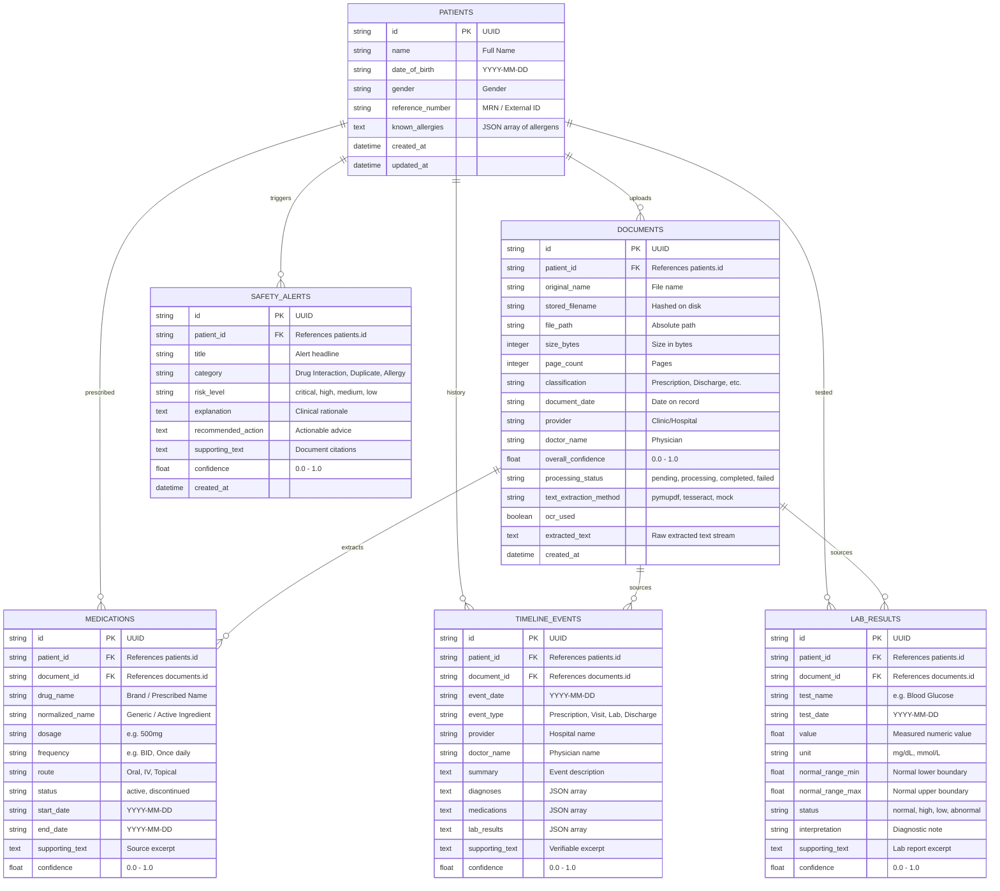

# MedGuard AI • Database Schema & Entity Relationship Model

MedGuard AI uses an entity-relational schema built with SQLAlchemy ORM, compatible with SQLite (local development/testing) and PostgreSQL (production).

---

## 1. Entity-Relationship Diagram

---

## 2. Table Specifications & Indexing Strategy

- **`patients`**: Indexed on `reference_number` and `name` for high-throughput lookup.
- **`documents`**: Foreign key to `patients.id` with `ON DELETE CASCADE`. Indexed on `(patient_id, processing_status)`.
- **`medications`**: Foreign key to `patients.id` and `documents.id`. Indexed on `(patient_id, status)` and `normalized_name`.
- **`safety_alerts`**: Indexed on `(patient_id, risk_level)`.
- **`lab_results`**: Indexed on `(patient_id, test_name, test_date)` to accelerate time-series aggregation.
- **`timeline_events`**: Indexed on `(patient_id, event_date)`.
