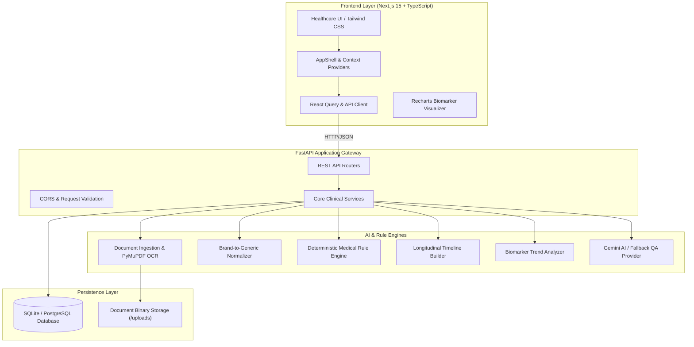
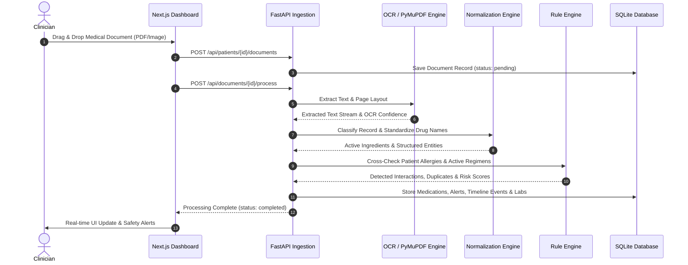
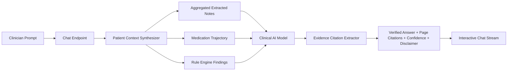

# MedGuard AI • System Architecture & Engineering Design

MedGuard AI is engineered as an enterprise-grade, privacy-centric medical document cross-checking platform designed to assist healthcare professionals in identifying medication conflicts, drug-drug interactions, duplicate therapies, allergy contraindications, and abnormal biomarker trends across unstructured health records.

---

## 1. High-Level System Architecture

---

## 2. Multi-Stage Document Ingestion Pipeline

When a medical record (PDF, JPEG, PNG, or TXT) is uploaded, it transitions through sequential analytical stages:

---

## 3. Clinical Rule Engine Architecture

The safety rule engine executes deterministic medical logic across the aggregated patient history:

1. **Drug-Drug Interactions (CYP450 & Pharmacodynamic Checks):**
   - Evaluates pairs of active medications (e.g., Fluoroquinolones like *Ciprofloxacin* with Anticoagulants like *Warfarin*).
   - Generates risk level (`critical`, `high`, `medium`, `low`) and concrete clinical action plans.
2. **Duplicate Therapy Detection:**
   - Detects brand vs. generic co-prescriptions (e.g., *Glucophage* + *Metformin* or *Lipitor* + *Atorvastatin*).
3. **Allergy Contraindications:**
   - Cross-references documented allergies (e.g., *Penicillin*) with antibiotic families (e.g., *Amoxicillin*, *Ampicillin*, *Augmentin*).
4. **Dosage Anomalies & Maximum Thresholds:**
   - Flags dangerous single or daily dosages.

---

## 4. Cross-Document Conversational Reasoning with Citations

---

## 5. Security, Privacy & HIPAA Guardrails

- **Zero Data Leakage:** All file uploads are stored locally and sandboxed.
- **Anonymization Support:** Patient identifiers and MRNs can be scrubbed before AI processing.
- **Auditable Citations:** Every AI output includes exact document excerpts and confidence levels to enable human-in-the-loop verification.
